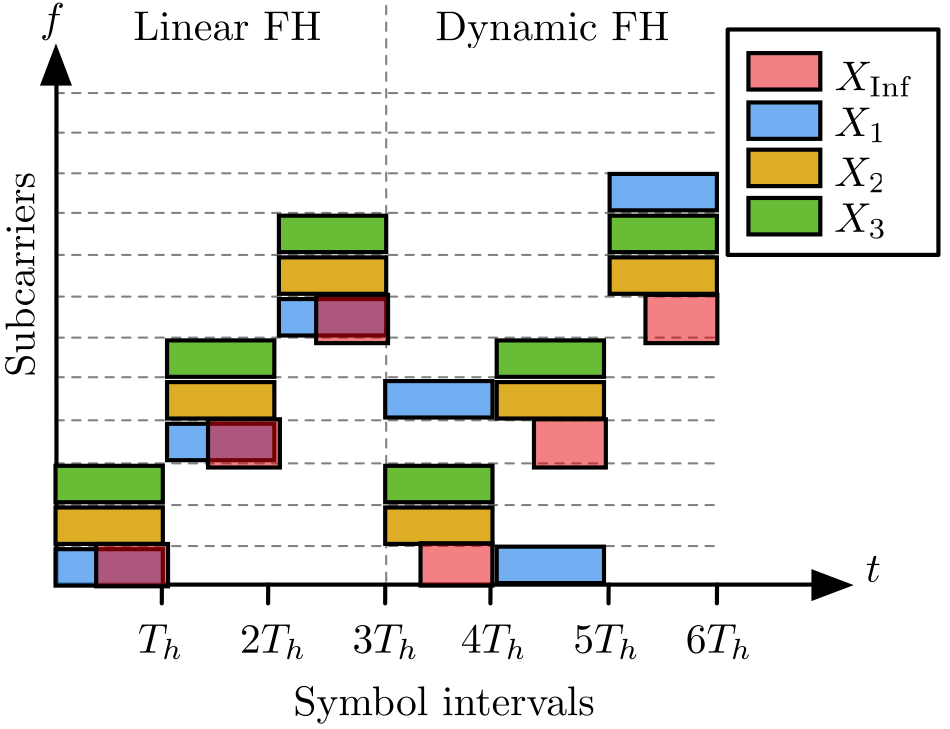
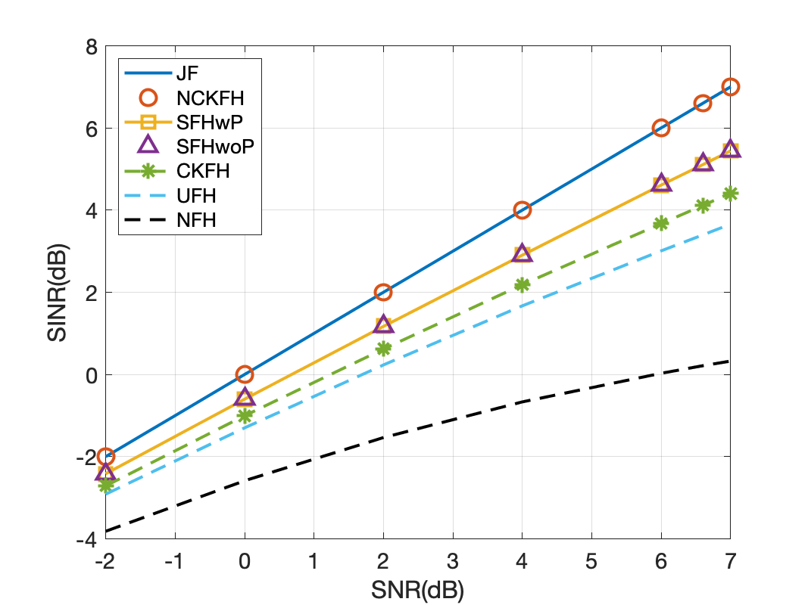
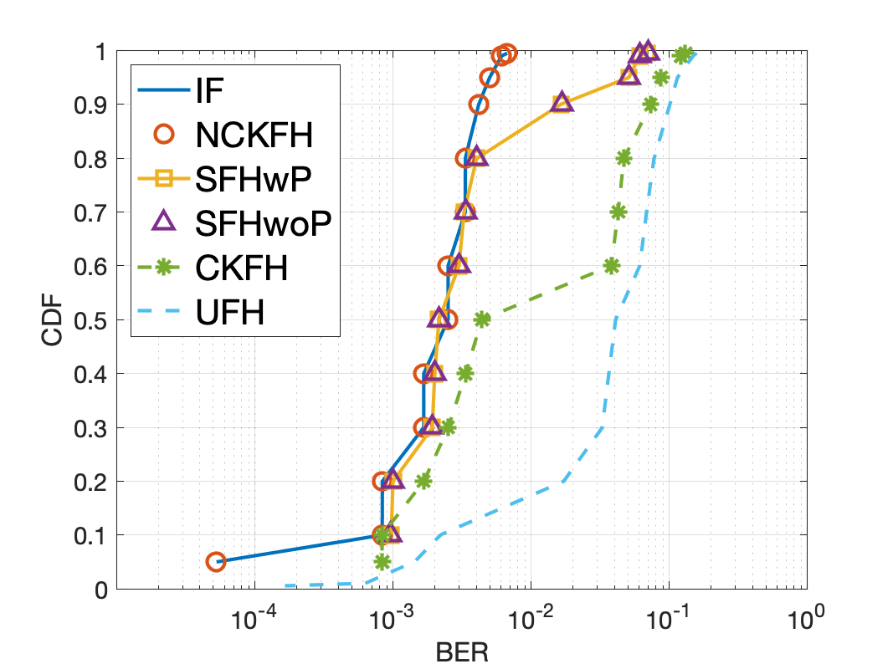

# Frequency Hopping (FH) for 5G New Radio mMTC Security

This repository contains the code for the paper *["Adaptive Frequency Hopping for 5G New Radio mMTC Security"](https://ieeexplore.ieee.org/abstract/document/10143116)*. The paper was presented at the 2023 IEEE International Conference on Industrial Technology (ICIT).

## Introduction
In this paper, we investigate the problem of FH pattern design for 5G NR mMTC UEs presented at the physical resource grid in 5G terrestrial communication networks. The problem is challenging due to the substantial computational overhead associated with the FH patterns for numerous mMTC UEs with short hopping intervals. We address this challenge by formulating the FH pattern design problem at the 5G PUCCH that prevents both attackers and friendly UE collisions. We present two FH schemes: one that utilizes known interference patterns, and another that utilizes only the interference statistics. Simulation results illustrate improved protection performance against interference for our proposed schemes compared to the traditional uniform FH scheme.

## Motivation 
Example of FH patterns     |       
:-------------------------:|
<!--  -->

The 5G NR mMTC UEs are allowed to use frequency hopping (FH) patterns. FH allows mMTC UEs to be flexible in accessing 5G spectrum resources and even be resilient to active jammers. When there are malicious entities capable of generating partial band interference, FH enables legitimate UEs to dynamically change their frequencies, mitigating jamming attacks as well as preventing information leakage. Unlike other mitigation methods such as pilot contamination detection and spoofing detection that are primarily concerned with threat monitoring, FH provides protection regardless of the status of threats.

## Usage    
The code is written in MATLAB. The main script is `fh.m`. The script generates the FH pattern for all UEs, SINR output, and BER output.  Using these outputs, the script `genFigures.m` generates the SINR performance and BER performance figures.

## Results
SINR output of proposed FH scheme             |  CDF of BER for SNR=6dB
:-------------------------:|:-------------------------:
  |  
